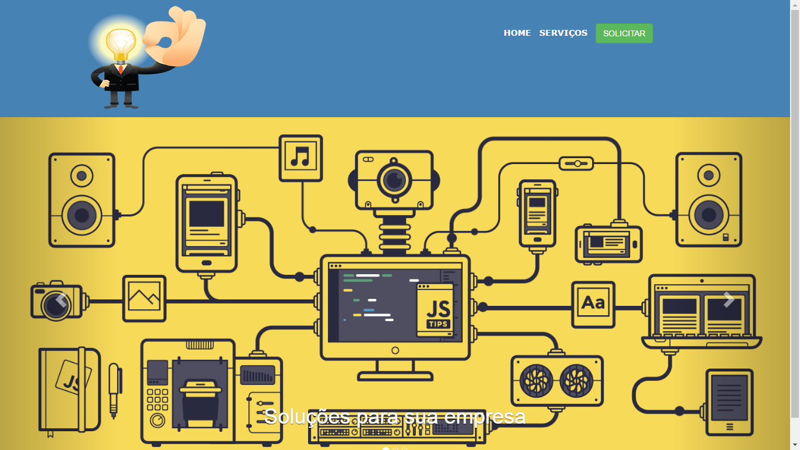
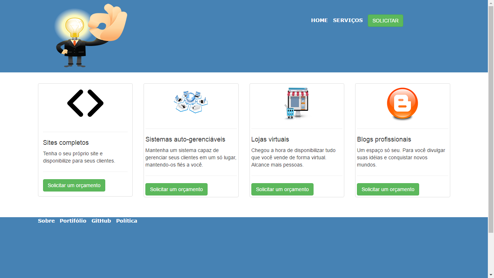
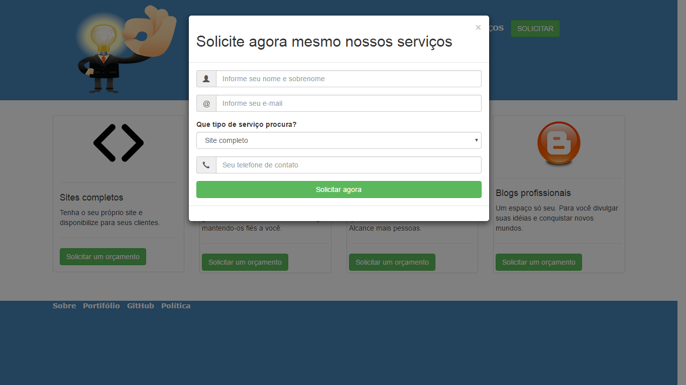

# SiteOficial
Um site com o intuito de promover o ensino de programação e reunir apaixonados pela mesma.

O grande propósito deste site é proporcionar a mim a prática nessária para ampliar meus conhecimentos como programador. Nele eu testo diversas funcionalidades, cujo as quais eu absorvo na teoria. 

<h1>Imagens do layout</h1>
<h3>Home page</h3>

<h3>Services Page</h3>

<h3>Page Contato</h3>
